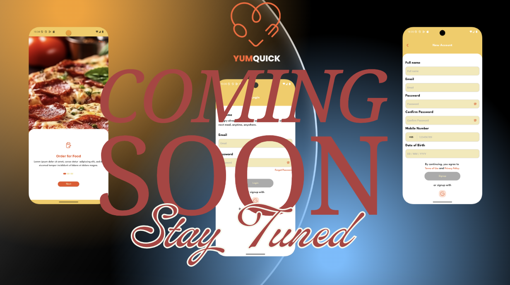

# 🍔 Eatzy – Food Delivery System

🚧 **Status:** Under Construction 🚧  
*(This project is actively being developed. Features and UI are still evolving.)*

Eatzy is a **modern food delivery application** built with **Flutter**, designed for a smooth user experience with a clean UI.  
The project integrates **MVVM architecture**, **Firebase backend**, and a sleek design inspired by a **Figma UI Kit**.

🔗 **Figma Design:** [Food Delivery App UI Kit](https://www.figma.com/design/E75KHHDlbQc8dqgKpITqSE/Food-Delivery-App-UI-Kit-Food-App-Design-Food-Mobile-App-Delivery-UI--Community-?node-id=1-423)

---

#UI

## ✨ Features

- 🛒 Browse restaurants & menus
- 🔍 Search & filter food items
- 📦 Add to cart & manage orders
- 👤 User authentication (Email/Google)
- 🔧 Built with **MVVM pattern** for scalability

---